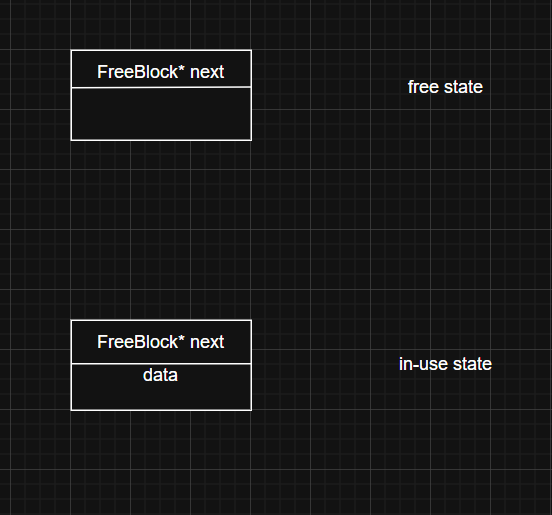

# Memory Pool

[](LICENSE) [](https://github.com/xjn2005/memory-pool/issues) [](https://github.com/xjn2005/memory-pool/stargazers) 
<p align="right">[简体中文](README.md) | [English](README_en.md)</p>

一个用 C++17 编写的固定大小内存池实现，适合高效管理大量小对象频繁分配/释放的场景。


---

## 主要特性

- 固定大小块分配，按**桶（bucket）**管理不同幂次的块大小（8、16、32 ... up to MAX_BUCKET_SIZE）。
- 批量申请大块内存（chunk），减少与操作系统的交互成本。
- 侵入式空闲链表：利用空闲块的存储空间保存 `next` 指针，分配/释放接近 O(1)。
- 提供 `scoped_allocate` RAII 辅助模板，简化异常安全的分配与释放。
- 超出最大桶时回退为 `new[]/delete[]` 以保证兼容性。

---

## 项目结构

```
├── include/
│   └── memory_pool.h    # 头文件
├── src/
│   ├── memory_pool.cpp  # 实现
│   └── test.cpp         # 简单测试程序
├── CMakeLists.txt       # 构建配置
└── README.md
```

---

## 如何编译与运行

在项目根目录下：

1. 创建构建目录并进入：

```bash
mkdir build
cd build
```

2. 生成构建文件：

```bash
cmake ..
```

3. 编译：

```bash
cmake --build .
```

4. 运行测试程序：

- Linux/macOS: `./test_exe`
- Windows (powershell/cmd): `test_exe.exe`

提示：如果要在 Release/Debug 模式之间切换，可在 cmake 命令中指定 `-DCMAKE_BUILD_TYPE=Debug`。

---

## 复杂语法与实现要点解释

下面对代码中一些可能不太直观的关键点做详细解释，便于理解实现细节：

### 对齐（alignment）与 `alignas`

常量 `ALIGNMENT` 定义最小对齐（例如 8 字节）。通过 `alignas(ALIGNMENT)` 保证 `FreeBlock::data` 的内存对齐满足基本要求。对齐对于某些类型（如 `double`） 非常重要，未对齐访问会导致性能下降或未定义行为。

### RoundUp 与 GetBucketIndex

- `RoundUp(size_t bytes)`：将大小上调到最接近的 `ALIGNMENT` 的倍数（例如 9 -> 16）。
- `GetBucketIndex(size_t bytes)`：基于上调后的大小返回对应桶的索引，桶大小按照 8、16、32... 的幂次增长，便于快速决定使用哪种 `FixedMemoryPool`。

### 侵入式链表（FreeBlock）

`union FreeBlock { FreeBlock* next; alignas(...) char data[1]; }`：
- 当块空闲时，前面的内存存放 `next` 指针构成链表；当分配给用户时，用户使用 `data` 存储数据。
- 这种设计节省额外的元数据空间，但要求释放的指针必须来自本池并且仍然未被覆盖。



### `allocate_new_chunk()` 的实现要点

- 使用 `operator new(size)` 分配一整块原始内存（未构造对象）。
- 将该 chunk 切割为若干 `block_size_` 大小的块，并形成链表，最后把链表头赋给 `free_list_head_`。
- 析构时使用 `operator delete(ptr)` 释放这些原始内存。

### `reinterpret_cast` 的用途

将 `char*` 地址转换为 `FreeBlock*`（或反向）使用 `reinterpret_cast`。这是低级内存管理中常见的做法，意味着你在进行未定义类型上的原始内存操作，务必确保对齐与合法性。

### `scoped_allocate<T>` 模板

这是一个返回带自定义 deleter 的 `std::unique_ptr<T, std::function<void(void*)>>` 的便捷函数：
- 分配原始内存并返回类型安全的指针；
- 当 `unique_ptr` 析构时，调用 `deallocate` 自动归还内存，实现异常安全。

示例：

```cpp
auto buf = pool.scoped_allocate<char>(100); // 自动释放
```

### 所有权检查 `owns(void* ptr)`

用于调试，检查一个指针是否位于任意已分配的 chunk 范围内，返回布尔值。

---

## 测试

`src/test.cpp` 做了简单验证：
- 测试 `scoped_allocate`（RAII）、多种大小的分配以及释放；
- 输出分配地址并断言非空。


---

## 反馈与贡献

非常欢迎通过仓库提交 **issue** 来提出问题、报告 bug 或建议改进。若在使用或理解代码时遇到问题，请随时在 issue 中提问，我会尽快回复。

---

## 许可证

MIT License
